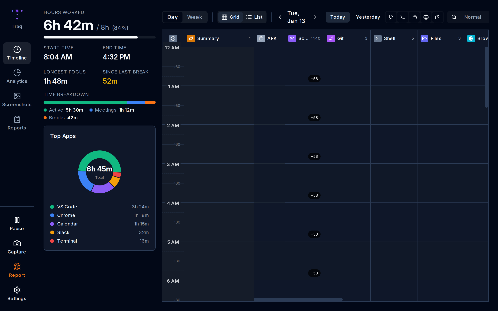

# Traq - Activity Tracker

Privacy-first desktop activity tracker that captures screenshots and tracks window focus to help you understand where your time goes.



## Purpose

### Vaguely

> ... automatically tracking computer usage for daily standups, weekly accomplishments calls, random audits, being able to go back in time and see how I got something working because I forgot to document everything, etc. - point is being able to capture as much as reasonably possible and having an easy way to find and use relevant parts of it helps in many ways (some you don't even know until you start using it and accumulate a decent amount of data, like seeing trends, etc.)

### Core Use Cases

#### 1. Daily Standups - "What did I do yesterday?"

Screenshots alone tell you: *"I was in VS Code and Chrome."*

With Traq's extended data sources:
- "Committed 3 fixes to auth-service (PR #142)"
- "Ran 12 test commands, 4 deployments"
- "Modified 8 files in `/src/auth/`"
- "Researched OAuth on Stack Overflow, reviewed 3 GitHub PRs"

**Much more standup-ready.**

#### 2. Weekly Accomplishments - "What did I ship this week?"

Screenshots: *"Here are 500 images of me typing."*

With data sources:
- "47 commits across 3 repos, +2,100/-800 lines"
- "Deployed 6 times to staging"
- "Touched 120 files, mostly `.ts` and `.go`"
- "Top domains: GitHub (45 visits), Jira (23), AWS Console (12)"

**Concrete metrics, not vibes.**

#### 3. Random Audits - "Prove you were working"

Screenshots: *"Here's me looking at code."*

With data sources:
- Git commits with timestamps = undeniable proof of contributions
- Shell history shows actual work (builds, tests, deploys)
- File modifications = deliverables being produced
- Browser history shows research, code reviews, documentation

**Evidence, not just presence.**

#### 4. Going Back in Time - "How did I fix that bug last month?"

This is where it gets powerful. Find the moment by combining:
- **Git**: The commit that fixed it
- **Shell**: Commands run around that time (`npm test`, `docker restart`)
- **Files**: Which files were modified together
- **Screenshots**: Visual context of the debugging session

**The full picture, reconstructed.**

#### 5. Capturing Data for Trends - "Where does my time actually go?"

Over weeks and months, patterns emerge:
- Most productive hours (commit frequency by time of day)
- Context-switching patterns (app transitions per hour)
- Research vs. coding ratios (browser vs. editor time)
- Project focus distribution (which repos get attention)

**Insights you didn't know you needed.**

---

### The Vision: Unified Timeline

The goal is a single timeline where everything correlates:

```
9:15 AM  [Git]        Committed "fix auth bug" to main
9:20 AM  [Shell]      npm test (passed)
9:25 AM  [Files]      Modified auth.ts, config.json
9:30 AM  [Screenshot] VS Code - auth.ts line 142
9:35 AM  [Browser]    Stack Overflow: "JWT refresh token best practices"
9:40 AM  [Git]        Committed "add token refresh logic"
```

Screenshots capture what was on screen. Data sources capture what was actually happening.

---

## Features

- **Screenshot Capture**: Automatic capture at configurable intervals
- **Perceptual Duplicate Detection**: Uses dhash algorithm to skip near-identical screenshots
- **Window Context Tracking**: Records active window title and application name
- **Session-Based Tracking**: Groups activity into sessions with AFK detection
- **Extended Data Sources**: Git commits, shell history, file modifications, browser history
- **Timeline View**: Interactive hour-based grid with AI summaries and activity blocks
- **Analytics Dashboard**: Charts showing activity patterns, app usage, and heatmaps
- **Report Generation**: Natural language time ranges with multiple export formats
- **Global Search**: Cross-data-source search with filtering
- **Native Desktop App**: Cross-platform via Wails (Linux, macOS, Windows)

## Installation

### Pre-built Binaries

Download the latest release for your platform:

| Platform | Download |
|----------|----------|
| Linux (x64) | [traq-linux-amd64.AppImage](https://github.com/hmahadik/traq/releases/latest/download/traq-linux-amd64.AppImage) |
| macOS (Universal) | [traq-macos-universal.zip](https://github.com/hmahadik/traq/releases/latest/download/traq-macos-universal.zip) |
| Windows (x64) | [traq-windows-amd64-installer.exe](https://github.com/hmahadik/traq/releases/latest/download/traq-windows-amd64-installer.exe) |

#### Linux

```bash
# Download the AppImage
curl -L -o traq https://github.com/hmahadik/traq/releases/latest/download/traq-linux-amd64.AppImage
chmod +x traq

# Run it
./traq
```

#### macOS

1. Download and extract the zip file
2. Move `traq.app` to your Applications folder
3. Right-click and select "Open" (first launch only, to bypass Gatekeeper)

#### Windows

1. Download the `.exe` installer
2. Run the installer
3. Launch Traq from the Start Menu

### Build from Source

#### Prerequisites

**Linux (Ubuntu/Debian)**

```bash
# Install Go 1.21+
sudo apt install golang-go

# Install Node.js 18+
curl -fsSL https://deb.nodesource.com/setup_18.x | sudo -E bash -
sudo apt install nodejs

# Install Wails dependencies
sudo apt install libgtk-3-dev libwebkit2gtk-4.1-dev

# Install Wails CLI
go install github.com/wailsapp/wails/v2/cmd/wails@latest

# For window tracking
sudo apt install xdotool
```

#### Build

```bash
# Clone the repository
git clone https://github.com/hmahadik/traq.git
cd traq

# Install dependencies
make install-deps

# Build the application
make build

# Run the binary
./build/bin/traq
```

::: tip Ubuntu 24.04+
Ubuntu 24.04 and newer use `webkit2gtk-4.1`. The Makefile handles this automatically with `make build`.

For older systems with `webkit2gtk-4.0`, use `make build-legacy`.
:::

## Development

```bash
# Run in development mode with hot reload
make dev

# Run Go tests
make test

# Run frontend tests
make test-frontend

# Generate bindings after changing Go methods
make bindings
```

### URL Routing

The app uses **hash-based routing** (e.g., `/#/session/37` instead of `/session/37`). This is required for Wails compatibility - browser history routing doesn't work reliably in Wails dev mode due to IPC initialization issues with direct URL access to non-root paths.

## Tech Stack

- **Backend**: Go 1.21+
- **Frontend**: React 18, TypeScript, Vite, Tailwind CSS
- **Desktop**: Wails v2
- **Database**: SQLite
- **UI Components**: Radix UI, Lucide icons, Recharts

## Project Structure

```
traq/
├── main.go                 # Application entry point
├── app.go                  # App struct with Wails bindings
├── internal/
│   ├── config/             # Configuration management
│   ├── inference/          # AI/ML inference (planned)
│   ├── platform/           # Platform-specific code
│   ├── service/            # Business logic services
│   ├── storage/            # SQLite database layer
│   └── tracker/            # Screenshot capture daemon
├── frontend/
│   ├── src/
│   │   ├── components/     # React components
│   │   ├── pages/          # Page components
│   │   ├── hooks/          # Custom React hooks
│   │   └── lib/            # Utilities
│   └── wailsjs/            # Generated Go bindings
├── build/
│   └── bin/                # Compiled binaries
├── Makefile                # Build commands
└── wails.json              # Wails configuration
```

## Data Storage

Data is stored in `~/.local/share/traq/` (Linux):

```
~/.local/share/traq/
├── data.db                 # SQLite database
└── screenshots/
    └── YYYY/MM/DD/         # Organized by date
        └── *.webp          # Screenshot files
```

## Configuration

Configuration is stored in the database and managed through the Settings page in the app.

**Default Settings:**
- Capture interval: 30 seconds
- Image format: WebP (80% quality)
- AFK timeout: 3 minutes

---

## Documentation

- [User Guide](https://hmahadik.github.io/traq/guide/getting-started)
- [TRAQ_SPEC.md](./TRAQ_SPEC.md) - Full product specification
- [CLAUDE.md](./CLAUDE.md) - Development context and architecture

## License

MIT License
